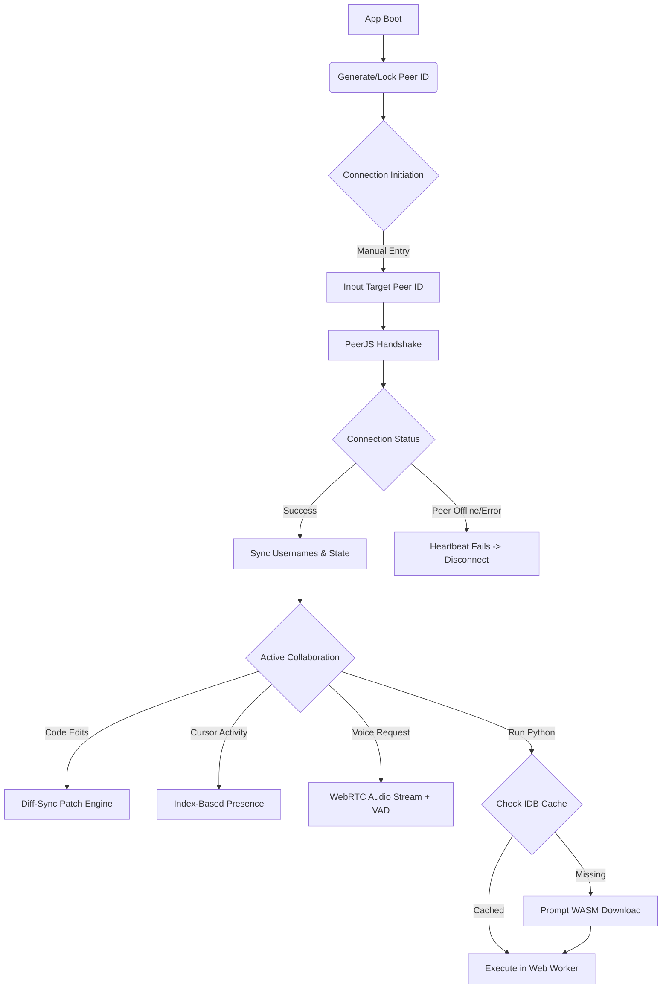

<h1 align="center">CODESATHEE</h1>
<h3 align="center">Tactical P2P Collaborative Dev Environment</h3>

  A zero-server, mobile-first collaborative code editor built for direct, frictionless linking. Exchange peer IDs to establish instant WebRTC code sync, voice channels, and remote presence. No accounts, no logs, no central server.

  
  
  
  
  

---

## The Mission: Frictionless Collaborative Coding

Standard collaborative code editors rely on central servers, complex CRDT frameworks, and heavy background processing that thrashes mobile browsers. This creates latency, drops WebRTC packets, and compromises privacy.

CODESATHEE acts as a direct tactical relay for developers. By leveraging WebRTC via PeerJS, the application establishes a direct browser-to-browser connection. Users generate a temporary "Peer ID," share it manually, and instantly spawn a collaborative code environment with voice channels. 

The latest evolution introduces a Diff-Sync engine, IndexedDB offline-first storage, and explicit WASM runtime caching—entirely within the constraints of a pure P2P architecture.

---

## Tactical Features & Engineering Decisions

* **Diff-Sync Engine (Anti-Data-Loss):** 
  Instead of heavy CRDTs or destructive full-document `setValue()` overwrites, the app implements `diff-match-patch`. When typing, only text deltas (patches) are calculated and sent over WebRTC. The receiving peer applies these patches using `replaceRange()`, which preserves their exact cursor position and prevents simultaneous typing from overwriting each other's code.
* **Index-Based Remote Presence:** 
  Remote cursors are mapped to string indices (`posFromIndex`) rather than absolute `{line, ch}` coordinates. If a peer inserts text above your remote cursor, the cursor shifts naturally with the text flow instead of getting stuck at the wrong line.
* **Explicit Pyodide WASM Caching:** 
  Python execution requires a 10MB WASM download. Instead of silently blocking the main thread, the app prompts the user explicitly. The binaries are downloaded with a live progress bar, cached in IndexedDB, and offloaded to a background Web Worker. This process happens only once per device and prevents UI freezes during WebRTC voice calls.
* **P2P Python Install Sync:** 
  When Peer A triggers the Pyodide download, a `py_installing` event is broadcasted. Peer B receives a real-time notification and is automatically prompted to install the runtime in parallel.
* **IndexedDB Local-First Architecture:** 
  All projects, active code, and snapshots are stored in IndexedDB to prevent mobile `localStorage` memory exhaustion. `localStorage` is strictly reserved for lightweight state: usernames, recent peer connections, and peer IDs.
* **WebRTC Heartbeats & Auto-Recovery:** 
  Mobile networks frequently drop WebRTC connections silently. A 3-second `ping`/`pong` heartbeat mechanism detects dead connections. If a peer fails to respond within 6 seconds, the app forcefully triggers `handleDisconnect()`, resets the UI, clears dead remote cursors, and closes voice channels cleanly.
* **Synced Save Protocol:** 
  When Peer A saves the project, a `sync_save` event is broadcasted. Peer B automatically receives the project metadata and code, saves it to their own IndexedDB, and updates their UI, preventing accidental data loss from state desync.

---

## Connection Architecture

GitHub natively supports Mermaid.js diagrams. Below is the visual map of how CODESATHEE establishes a direct peer connection, syncs state, and manages execution:

---

## How to Deploy and Use

This application is 100% client-side and is deployed on Vercel. You can deploy your own instance instantly by pushing the code to a GitHub repository and importing it into Vercel.

### 1. Link Up
1. Open the deployed application.
2. Set your **Callsign** in the identity card.
3. Your unique **Peer ID** will be generated automatically and locked into `localStorage`.
4. Click **CONNECT P2P** and share your ID with a peer, or input a peer ID manually and click **LINK**.

### 2. Establish Dev Environment
1. Once linked, the editor interface will open, displaying the connected peer's username.
2. Start typing in the CodeMirror editor. Text deltas sync automatically with strict debouncing.
3. Change languages using the dropdown. Select **Python** to trigger the explicit WASM download prompt.
4. To establish a voice channel, click the **VOICE** button in the nav. The receiving peer will get an incoming call overlay to **Accept** or **Reject**.

### 3. Session Management
* **Save Projects:** Click the **SAVE** button. The project is stored in IndexedDB and synced to your peer's local storage automatically.
* **Local Snapshots:** Open the **TOOLS** panel and create a local timeline snapshot. Snapshots are stored in IndexedDB for ultimate resilience.
* **Disconnect:** Click the brand logo to return to the landing page. If a peer disconnects, the heartbeat system will automatically detect it and reset the UI.

---

## Tech Stack

* **PeerJS / WebRTC:** Core engine for peer discovery, data channeling, and direct media streaming.
* **CodeMirror 5:** Lightweight, mobile-optimized code editor with syntax highlighting and bracket matching.
* **diff-match-patch:** Google's library for calculating text deltas for efficient, lossless P2P sync.
* **IndexedDB:** Browser database for storing heavy project data and the 10MB Pyodide WASM cache.
* **Pyodide (Web Worker):** Python execution engine offloaded to a background thread to prevent main-thread freezing.
* **Vanilla JavaScript:** Zero frameworks. All DOM manipulation, sync logic, and event handling are written in raw, optimized JS.
* **Vanilla CSS:** Custom tactical dark-mode styling with CSS variables, `clip-path` geometrics, and high-contrast aesthetics.
